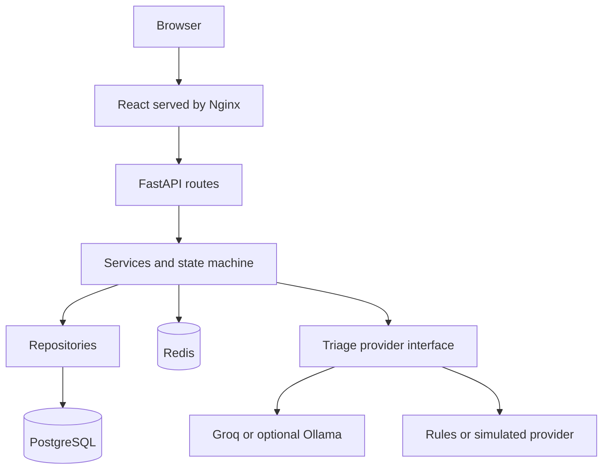
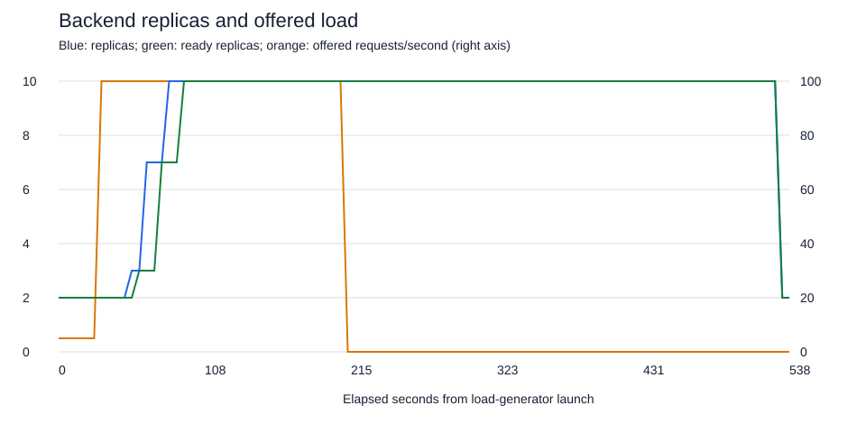

# CivicPulse

[](https://github.com/MuhammadAbdullah8741/civicpulse/actions/workflows/ci.yml)
[](https://github.com/MuhammadAbdullah8741/civicpulse/actions/workflows/cd.yml)

CivicPulse is a municipal complaint intake and triage assignment. Residents submit
synthetic complaints; an operator dashboard filters reports and enforces status
transitions. A statistics view shows totals, cache state and recent provider
outcomes. The project demonstrates typed interfaces, resilient AI integration,
containers, Kubernetes and gated delivery.

## Quickstart on Windows

Prerequisites: Git and a running Docker Desktop Linux engine. Clone this
repository, open PowerShell in its root, and run:

```powershell
.\scripts\Start-Local.ps1
```

The script creates a random local database password only when .env is absent,
builds and starts Compose, runs migrations and seeds at least 30 reports. It
preserves existing credentials and volumes. First-time image downloads require
Internet access. Keep an existing database password unchanged when reusing its volume.

- Application: http://localhost:8080
- API documentation: http://localhost:8000/docs
- Default provider: simulated; no API key or Ollama download is needed.
- Stop: `docker compose stop`. Resume: `docker compose up -d --wait`.
- `docker compose down` preserves data; `down -v` deletes volumes and data.

For a laptop already running the assignment's k3d cluster, stop that cluster
with `k3d cluster stop civicpulse` before starting Compose if resources are tight.
Restart it later with `k3d cluster start civicpulse`.

## Architecture



In Compose, Nginx proxies /api to the backend. In Kubernetes, Traefik sends /api
directly to the backend and / to the frontend. Frontend runtime configuration
selects its upstream without rebuilding browser assets. PostgreSQL and Redis
are isolated on Compose's internal network; the backend also joins edge for
frontend traffic and hosted LLM egress. See [deployment ADR](docs/adr/0003-deploy-by-sha-and-digest.md).

## API

| Method | Path | Contract |
|---|---|---|
| POST | /api/complaints | 201 with UUID and triage; 400 field errors; 429 with Retry-After |
| GET | /api/complaints | category/priority/status filters; page and page_size <=100; total |
| GET | /api/complaints/{id} | One report, or 404 |
| PATCH | /api/complaints/{id}/status | Valid transition, or 409 naming the attempted transition |
| GET | /api/stats | Counts by category/priority/status; X-Cache HIT or MISS |
| GET | /api/meta/providers | Active provider, cache hit rate and last 20 outcomes |
| GET | /health | Process health; does not query dependencies |
| GET | /ready | PostgreSQL and Redis readiness; 503 on dependency failure |
| GET | /metrics | Prometheus counters and histograms |

The interactive OpenAPI documentation provides request/response schemas.
Text is 10-2000 characters, location 3-200, and contact optional. Status transitions:
open -> in_progress -> resolved; open or in_progress -> rejected. Resolved and
rejected are terminal. Concurrent/invalid updates return 409.

## AI, caches and privacy

TRIAGE_PROVIDER selects rules, simulated, llm (Groq) or ollama. Hosted/local model
responses are schema-validated. Each HTTP attempt has a 10-second limit; timeouts,
429 and 5xx receive one jittered retry. Other errors fall back immediately to
rules and record rules:fallback. CI selects deterministic simulated responses.

The triage cache uses content/provider/model hashes with a 24-hour TTL. Fallback
results are not cached as provider successes. The stats cache lasts 30 seconds
and is invalidated on writes. Neither a hash nor a TTL is a privacy guarantee.
Use synthetic data: original complaint/contact data is stored in PostgreSQL,
and regex redaction cannot guarantee anonymity. See [PII ADR](docs/adr/0004-pii-and-data-governance.md)
and [AI assistance disclosure](docs/AI-USAGE.md).

## Verification

```powershell
docker compose exec -T -e RUN_DB_TESTS=1 -e COVERAGE_FILE=/tmp/civicpulse.coverage backend python -m pytest -q -p no:cacheprovider --cov=app --cov-report=term-missing --cov-fail-under=65
npm --prefix frontend ci
npm --prefix frontend run lint
npm --prefix frontend test
npm --prefix frontend run build
npm --prefix frontend run api:check
python -m unittest discover -s tests/delivery -v
node frontend/scripts/smoke-container.mjs --write
python scripts/check_submission.py
```

CI additionally runs Ruff, mypy, npm audit, Trivy, kubeconform and workflow
validation. CD repeats the complete CI suite before publishing SHA-labelled
images and Syft SBOMs; a temporary k3d cluster deploys the published digests.
Version tags trigger a gated release. Successful run URLs belong in
[submission metadata](docs/submission.json); a badge alone is not evidence of release completion.

## Measured scaling results

| Run | HTTP failures | Dropped iterations | p95 | Peak replicas |
|---|---:|---:|---:|---:|
| Baseline, 100 offered requests/s | 0 | 847 | 2514 ms | 10 |
| VPA requests applied, 100/s | 28 | 515 | 677 ms | 7 |
| Rolling update, 30/s | 0 of 5401 | 0 | 13.18 ms | 2 |

Both 100/s runs failed load thresholds. Lower latency in the tuned run does not
make it a passing result. A subsequent probe adjustment preceded the successful
rolling update. The rollout used the same application bytes under a new tag;
it demonstrates rolling replacement under that local load, not a changed-code
release or a production SLA. [Raw evidence and comparison](docs/evidence/scaling/COMPARISON.md).



## Documentation and demonstration

- [Runbook](docs/RUNBOOK.md): operations, deployment, recovery and rollback.
- [Engineering notes](docs/ENGINEERING-NOTES.md): eight answers with source references.
- [Final submission checklist](docs/FINAL-SUBMISSION.md): evidence, release and demo steps.
- [Frontend screenshots and evidence index](docs/evidence/final/README.md): capture from the running application.
- [Production Compose](docs/PRODUCTION-COMPOSE.md) and [Kubernetes](docs/PHASE9-KUBERNETES.md).

This is an educational demonstration, without operator authentication, TLS
termination or a citizen-data retention system. Keep it local and use synthetic
reports. The trusted proxy configuration assumes a dedicated, trusted k3s
cluster; it is not suitable for an untrusted multi-tenant pod network.
